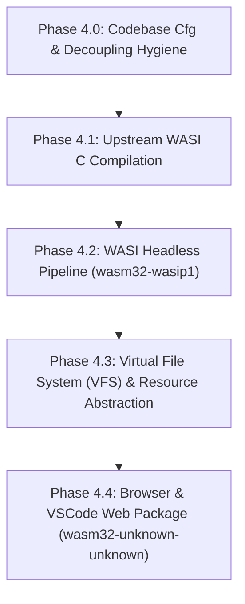

# WebAssembly Target Audit & Compatibility Roadmap

**Status:** Audit complete · Stage 4 Planning (see [`RELEASE_CRITERIA.md`](RELEASE_CRITERIA.md) §Stage 4).  
**Date:** 2026-09-03  
**Audited Targets:** `wasm32-wasip1` / `wasm32-wasip2`, `wasm32-unknown-unknown`, `wasm32-unknown-emscripten`.

---

## 1. Executive Summary & Viability Matrix

`latexml-oxide` is architected as an ultra-fast, single-process or multi-worker native engine for converting LaTeX documents into HTML5/MathML, XML, and other structured formats. Bringing `latexml-oxide` to WebAssembly targets unlocks in-browser compilation (e.g. `vscode.dev`, `github.dev`, web-based LaTeX editors, and client-side preview in `ar5iv-editor`) as well as serverless WASI edge workers (Cloudflare Workers, Fastly Compute, Wasmer/Wasmtime).

While the pure Rust components of the workspace (`winnow`, `regex`, `flate2` with `miniz_oxide`, `string-interner`, `unicode-normalization`, `unidecode`, `rustc-hash`, `clap`, `serde_json`, `tar`, and `zip`) compile to WebAssembly cleanly today, full end-to-end compilation currently encounters **three hard architectural blockers**:

1. **Native C Library FFI (`libxml2`, `libxslt`, `libmarpa`)**: All three libraries require C standard library headers, a C cross-compiler (`clang` with `wasi-sdk` or `emcc`), and custom link directives that fail under default Cargo build scripts. Because all three Rust sys crates are maintained by the author (`dginev`), upstream fixes are directly viable.
2. **Subprocess Spawning (`std::process::Command`)**: 9 runtime spawn sites across the workspace shell out to external tools (`kpsewhich`, `tftopl`, `texlua`, `latex`, `dvipng`, `dvisvgm`, `convert`, `mutool`, `pdftocairo`, `gs`, `ps2pdf`). On WebAssembly, process spawning is entirely unsupported (`ErrorKind::Unsupported`).
3. **OS Primitives & Threading**: Host threads (`Watchdog::with_limits` and `on_worker`), POSIX process controls (`fork`, `poll`, `SIGKILL`, `libc::killpg`), native stack-switching (`stacker`/`psm`), and host filesystem access (`std::fs` without VFS) require platform abstraction.

### Workspace Crate Readiness Matrix

| Crate | Pure Rust? | Primary WASM Blockers | Target Workarounds / Solutions |
|---|---|---|---|
| [`latexml_core`](../../latexml_core) | ⚠️ Mixed | `libxml2` DOM binding; `marpa` dependency in `error.rs`; `Watchdog` thread spawning; `stacker` stack switching | Use wasi-compiled `libxml2.a`; decouple `marpa`; cfg-gate watchdog thread on `wasm32`; document engine recursion limits. |
| [`latexml_codegen`](../../latexml_codegen) | ✅ Host Only | Runs on host at build time (proc-macro). | No runtime WASM impact. |
| [`latexml_math_parser`](../../latexml_math_parser) | ⚠️ C-FFI | `marpa-asf` (`libmarpa-asf-sys` compiling `libmarpa 8.6.2` C source); `libxml2` | Compile `libmarpa` with `wasi-sdk`; pure algorithmic C requires only standard libc memory and math functions. |
| [`latexml_engine`](../../latexml_engine) | ⚠️ Mixed | Calls `kpsewhich`/`pdflatex` in `dump_paths.rs`; `texlua` in `lua_bridge.rs` | Format dumps already embedded via `build.rs`; gate `Command::new` probes to return `None` on wasm; disable LuaTeX bridge. |
| [`latexml_package`](../../latexml_package) | ⚠️ Mixed | `kpsewhich` & `tftopl` calls in `line_fontmap.rs` | Graceful fallback when external font metric binaries are absent. |
| [`latexml_post`](../../latexml_post) | ⚠️ Heavy C-FFI | `libxslt`/`libexslt` (XSLT transforms); external graphic converters (`convert`, `mutool`, `pdftocairo`, `gs`); `rusqlite` | Statically link wasi-compiled `libxslt.a`; bypass external image conversion (keep MathML / raw graphics); feature-gate `rusqlite`. |
| [`latexml_contrib`](../../latexml_contrib) | ✅ Clean | Optional `rhai` runtime bindings; external process runner in `script_bindings` | Pure Rust in default configuration; on `wasm32-unknown-unknown`, getrandom needs `wasm_js`. |
| [`latexml_oxide`](../../latexml_oxide) | ⚠️ Binary/LSP | `mimalloc` allocator; `lsp_server/unix.rs` (`fork`, `poll`, `pipe`); worker process spawning | Disable `mimalloc` for `wasm32` (use `dlmalloc`); adapt `lsp_server/generic.rs` or Web Worker message channel; single-process execution. |

---

## 2. Target Platform Analysis & Trade-offs

### 2.1 `wasm32-wasip1` / `wasm32-wasip2` (WASI CLI & Edge Runtimes)
* **Viability:** **Highest near-term viability (Recommended Phase 1).**
* **Capabilities:** Provides POSIX-like `wasi-libc`, real file I/O for pre-opened host directories (`--dir`), high-resolution clocks (`Instant::now()` works out of the box), and memory allocation.
* **Toolchain Requirements:** Requires `wasi-sdk` (Clang + wasi-libc) to cross-compile C dependencies (`libmarpa`, `libxml2`, `libxslt`).
* **Limitations:** No `fork`/`exec` (subprocesses unsupported); no native OS thread creation in WASI p1.
* **Target Audience:** Headless CLI execution via `wasmtime`/`wasmer`, containerless microservices, and serverless edge functions (Cloudflare Workers, Fastly Compute).

### 2.2 `wasm32-unknown-unknown` (Browser Web Workers & WebExtension Host)
* **Viability:** **Required for Stage 4 (`vscode.dev`, `github.dev`), but technically demanding.**
* **Capabilities:** Executes directly in browser JavaScript runtimes with zero external dependencies via `wasm-bindgen`.
* **Limitations:**
  - No C standard library (`libc` is a stub; `clang` cannot find `stdio.h` or `stdlib.h` out of the box).
  - No filesystem: any `std::fs` call panics or returns `ErrorKind::Unsupported`.
  - `Instant::now()` panics at runtime without `web-time` or a custom JS performance hook.
  - `getrandom` 0.3 panics at compile time without `--cfg getrandom_backend="wasm_js"`.
  - No subprocesses or OS signals.
* **Strategy:** Requires linking pre-compiled WASI object files or using an in-memory Virtual File System (VFS) abstraction.

### 2.3 `wasm32-unknown-emscripten` (Emscripten Full POSIX Emulation)
* **Viability:** **Alternative bridge.**
* **Capabilities:** Built-in support for ports, POSIX libc, virtual filesystems (MEMFS/IDBFS), and simulated threading via Web Workers.
* **Trade-offs:** Heavy JavaScript runtime footprint, incompatible with pure `wasm-bindgen` Rust workflows, and non-idiomatic distribution for web extensions.

---

## 3. Deep-Dive: Native C Dependencies

All four primary C dependencies are encapsulated in crates owned and maintained by the project author ([`dginev`](https://github.com/dginev)):

```
latexml-oxide
 ├── libxml (0.3.21)           --> libxml2 (C)
 ├── libxslt (0.1.5)           --> libxslt + libexslt (C)
 ├── marpa-asf (0.3.0)         --> libmarpa 8.6.2 (C via cc-rs)
 └── kpathsea (0.3.4)          --> libkpathsea (C)
```

### 3.1 `libxml` (`rust-libxml`) & `libxml2`
* **Role in Codebase:** Essential. `libxml::tree::Node` and `Document` form the foundational DOM abstraction throughout `latexml_core`, `latexml_engine`, `latexml_package`, and `latexml_post`. Pure Rust DOM replacement is unfeasible without rewriting the entire engine.
* **Current Blocker:**
  - `libxml-0.3.21/build.rs` restricts detection to `target_family = "unix"`, `target_os = "macos"`, or `target_family = "windows"`. On WASM targets, it defaults to `panic!("Could not find libxml2.")`.
  - When `LIBXML2` points to a static library, `generate_bindings` runs `bindgen` on `wrapper.h` without header search paths, failing with host clang.
* **Resolution Strategy:**
  1. Build static `libxml2.a` using `wasi-sdk` / `clang --target=wasm32-wasi` with minimal flags:
     ```bash
     ./configure --host=wasm32-wasi --prefix=$PREFIX \
       --enable-static --disable-shared \
       --without-python --without-zlib --without-lzma --without-icu --without-threads
     ```
  2. Upstream patch to `rust-libxml/build.rs`:
     - Allow `target_family = "wasm"` when `LIBXML2_STATIC` / `PKG_CONFIG_PATH` or `LIBXML2` + `LIBXML2_INCLUDE` is set.
     - Ship pre-generated `bindings_wasm32.rs` so cross-compiling doesn't require host `libclang` to parse C headers.

### 3.2 `libxslt` (`rust-libxslt`) & `libexslt`
* **Role in Codebase:** Transforms intermediate LaTeXML XML into HTML5, XHTML, JATS, and TEI via XSLT stylesheets (`latexml_post/src/xslt.rs`).
* **Current Blocker:**
  - `build.rs` falls back to `cargo:rustc-link-lib=dylib=xslt`, which fails at link time on WASM.
  - `latexml_post/src/xslt.rs` accesses `xsltMaxDepth` via `libc::dlsym` (unix) or `extern static` (windows).
* **Resolution Strategy:**
  1. Build static `libxslt.a` and `libexslt.a` against wasi-compiled `libxml2.a`:
     ```bash
     ./configure --host=wasm32-wasi --prefix=$PREFIX \
       --enable-static --disable-shared \
       --with-libxml-prefix=$PREFIX --without-crypto --without-plugins
     ```
  2. In `latexml_post/src/xslt.rs`, the non-unix/non-windows arm already exists (lines 69–71) and safely skips setting `xsltMaxDepth` (falling back to libxslt's default recursion limit of 3000).

### 3.3 `marpa-asf` (`libmarpa-asf-sys`) & `libmarpa`
* **Role in Codebase:** Earley grammar parser used in `latexml_math_parser` for ambiguous mathematical expression parsing.
* **Current Blocker:**
  - `libmarpa-asf-sys` compiles 6 C files (`marpa.c`, `marpa_obs.c`, `marpa_avl.c`, `marpa_tavl.c`, `marpa_ami.c`, `marpa_codes.c`) using `cc::Build`.
  - On `wasm32-unknown-unknown`, host clang fails with `fatal error: stdio.h file not found`.
  - On `wasm32-wasip1`, host clang fails unless `WASI_SDK_PATH` or sysroot is explicitly passed.
  - In `latexml_core/Cargo.toml`, `marpa` is an unconditional dependency despite only being used in `latexml_core/src/common/error.rs` for `impl From<marpa::error::Error> for Error`.
* **Resolution Strategy:**
  1. **Immediate Workspace Win:** Decouple `marpa` from `latexml_core`. Move `impl From<marpa::error::Error> for Error` into `latexml_math_parser` or behind an optional feature. This eliminates `libmarpa` as a blocker for `latexml_core`, `latexml_engine`, and `latexml_package`!
  2. **Upstream Fix:** In `libmarpa-asf-sys/build.rs`, when building for `wasm32-wasip1`, detect `WASI_SDK_PATH` or configure `cc::Build` to pass `--sysroot`. Because Marpa is purely algorithmic in-memory C (no OS calls, only `malloc`/`free` and string operations), it compiles cleanly under WASI libc.

### 3.4 `mimalloc` (`libmimalloc-sys`)
* **Role in Codebase:** Fast multi-threaded allocator in `latexml_oxide` binaries.
* **Current Blocker:** `mimalloc` C source does not compile out-of-the-box on `wasm32-unknown-unknown`.
* **Resolution Strategy:**
  - In `latexml_oxide/Cargo.toml`:
    ```toml
    [target.'cfg(not(target_arch = "wasm32"))'.dependencies]
    mimalloc = { version = "0.1", default-features = false }
    libmimalloc-sys = { version = "0.1", default-features = false, features = ["extended"] }
    ```
  - Gate `libmimalloc_sys::mi_collect(true)` calls in `core_interface.rs`, `render_workers.rs`, and `post.rs` under `#[cfg(not(target_arch = "wasm32"))]`.
  - WebAssembly targets will use Rust's built-in `dlmalloc`.

### 3.5 `rusqlite` (`libsqlite3-sys`)
* **Role in Codebase:** SQLite persistence for `ObjectDB` `--dbfile` mode in `latexml_post`.
* **Status:** **Non-blocker.** Modern `rusqlite v0.40.2` compiles cleanly for `wasm32-unknown-unknown` using `sqlite-wasm-rs` and `rsqlite-vfs`. Furthermore, default in-memory conversions do not use `--dbfile` and can be feature-gated.

### 3.6 `kpathsea` (`kpathsea_sys`)
* **Role in Codebase:** TeX Live file and package resolution.
* **Status:** **Graceful degradation already built in.** When neither `libkpathsea.a` nor `kpsewhich` is found, `kpathsea_sys` sets `cargo:linked=0` and `latexml_core::pathname` sets backend to `KpathseaBackend::Unavailable`. Lookups safely return `None`.

### 3.7 Evaluation of Pure-Rust Ecosystem Alternatives (crates.io)

An obvious question is whether the native C dependencies can simply be replaced with existing pure-Rust crates on crates.io to avoid the C cross-compilation toolchain entirely. When evaluating the crates.io ecosystem against the functional requirements of `latexml-oxide`, this replacement proves unviable without major multi-month subsystem rewrites that would compromise compatibility:

| Native Dependency | Evaluated Pure-Rust Crates | Viability | Technical Analysis & Trade-offs |
|---|---|---|---|
| **`libxml2`** | **`sxd-document` + `sxd-xpath`** | 🟡 **Viable for pure WASM (`wasm32-unknown-unknown`)** | • **Full XPath 1.0 Engine:** `sxd-xpath` implements the complete W3C XPath 1.0 specification (axes, node-tests, predicates, functions, namespaces via `Context::register_namespace`), providing the exact selector capabilities required by `DefRewrite` (`latexml_core/src/rewrite.rs`).<br/>• **Arena-Allocated Mutable DOM:** Contrary to common misconception, `sxd-document` is **not** read-only. It provides a fully mutable arena DOM (`Package`) with `append_child`, `replace_children`, `remove_child`, `remove_from_parent`, `set_attribute_value`, and sibling navigation.<br/>• **WASM Compatibility:** 100% pure Rust (`typed-arena` + `peresil`), compiling out of the box to `wasm32-unknown-unknown` with zero C-FFI or libc dependencies.<br/>• **Gaps vs `libxml2`:** Lacks RelaxNG schema validation (skipped under `--novalidate`), Canonical XML (`c14n`), and requires an abstraction layer over `libxml::tree::Node` across `latexml_core`. |
| **`libxml2`** (other) | `xot`, `roxmltree`, `quick-xml` | ❌ **Unviable for core digestion** | • `roxmltree` is strictly read-only/immutable.<br/>• `quick-xml` is a pull parser/serializer with no DOM or XPath.<br/>• `xot` has an efficient mutable arena DOM, but lacks an XPath 1.0 engine, requiring custom query machinery. |
| **`libxslt` / `libexslt`** | `xrust` (pure-Rust XSLT 3.0), browser `XSLTProcessor` | 🟡 **Viable via dual strategy** | • **Browser target (`wasm32-unknown-unknown`):** Delegate XSLT post-processing to the browser host's native `XSLTProcessor` via `web-sys` / JavaScript bridge, or serialize HTML5 directly from the core DOM.<br/>• **`xrust`:** Full pure-Rust XQuery/XPath/XSLT 3.0 engine targeting WASM. However, LaTeXML’s 20-year legacy stylesheets rely heavily on **EXSLT 1.0 extension functions** (`exsl:node-set()`, `func:function`, `func:result`, `set:distinct()`, `str:split()`), which require translation to standard XSLT 3.0. |
| **`libmarpa`** | `earlgrey`, `frithu`, `bnf`, `cfg` | ❌ **Unviable without rewriting math ambiguity pipeline** | • **Leo's Optimization & ASF Traversal:** LaTeXML's math grammar is intentionally wide and ambiguous, parsing arbitrary LaTeX math into an Ambiguous Syntax Forest (ASF) of up to 5,000 trees per formula, pruned via semantic tie-breaking (`asf_traverser.rs`). Libmarpa provides Jeffrey Kegler's specialized Earley parser with Leo's optimization (critical to prevent exponential blowup on right-recursive math rules) and native ASF traversal.<br/>• Pure-Rust Earley crates like `earlgrey` lack Marpa's ASF traversal engine and Leo optimization.<br/>• **Toolchain reality:** Libmarpa is pure algorithmic C (obstack, AVL trees, Earley tables). It has **zero OS calls** (no filesystem, no sockets, no threads). Compiling `marpa.c` with `wasi-sdk` is trivial compared to rewriting the 1,328-test math parser.<br/>• **Immediate Decoupling Win:** `latexml_core` does not actually use Marpa's parser—it only references it in `latexml_core/src/common/error.rs` for `impl From<marpa::error::Error> for Error`. Moving that conversion into `latexml_math_parser` decouples `marpa` from `latexml_core`, `latexml_engine`, and `latexml_package` immediately without any crate replacement. |
| **`sqlite3`** | `sqlite-wasm-rs` (via `rusqlite`) | ✅ **Already WASM-compatible** | `rusqlite v0.40.2` compiles cleanly to `wasm32-unknown-unknown` out of the box using `sqlite-wasm-rs` and `rsqlite-vfs`. Furthermore, `--dbfile` is optional (default in-memory conversions don't use it). |
| **`mimalloc`** | `dlmalloc` (Rust `std` default) | ✅ **Built-in / Zero Work** | Rust's standard library defaults to `dlmalloc` on WebAssembly targets. Gating `mimalloc` off via `#[cfg(not(target_arch = "wasm32"))]` cleanly resolves this. |

**Strategic Architecture: Dual-Track WebAssembly Target**

Based on this evaluation, the optimal path forward bifurcates based on the target runtime environment:

1. **Track 1: Server-side & Edge WASM (`wasm32-wasip1` / `wasm32-wasip2`)**
   * **Target:** Node.js, Cloudflare Workers, Fastly Compute, Wasmer/Wasmtime CLI.
   * **Approach:** Cross-compile static `libxml2.a`, `libxslt.a`, and `libmarpa.a` via `wasi-sdk`.
   * **Benefit:** 100% bug-for-bug parity, full EXSLT support, RelaxNG validation, and identical CLI behavior with zero code rewrites (~3–5 days setup).

2. **Track 2: Pure Browser / Client-Side WASM (`wasm32-unknown-unknown`)**
   * **Target:** In-browser live editor preview (VS Code Web, browser canvas, client-side documentation viewer) where C-FFI / POSIX emulation is unavailable.
   * **Approach:** Introduce an XML backend abstraction in `latexml_core` backed by **`sxd-document` + `sxd-xpath`**.
   * **XPath & Mutation Fidelity:** Fulfills all `DefRewrite` requirements (`findnodes` against subtrees and document root, live node creation, attribute mutation, child replacement, and namespace scopes).
   * **Post-processing:** Leverage the browser's native `XSLTProcessor` or emit HTML5 directly from the core DOM.
   * **Benefit:** Zero C dependencies, instant load times, small WASM binary size (~5–8 MB uncompressed), and pure-Rust portability.

---

## 4. Subprocess Spawning Inventory (`Command::new`)

WebAssembly sandboxes have no `fork()`, `exec()`, or process spawning. Every `Command::new` invocation must be audited and handled:

| Location | Invocation | WASM Behavior | Remediation / Fallback |
|---|---|---|---|
| `latexml_core/src/util/pathname.rs:258,291` | `kpsewhich` (ambient version & root probes) | Returns error / panics | Gate probes with `#[cfg(not(target_arch = "wasm32"))]`; immediately return `None` on WASM. |
| `latexml_engine/src/dump_paths.rs:97,111` | `kpsewhich`, `pdflatex` (year detection) | Fails to detect year | Embedded dumps in `latexml_engine` already provide built-in formats; fall back to embedded default without spawning. |
| `latexml_engine/src/lua_bridge.rs:185,315` | `texlua`, `kpsewhich` (LuaTeX execution) | Fails | Gate `lua_bridge` behind a runtime capability check; disable LuaTeX scripts on WASM. |
| `latexml_package/src/package/line_fontmap.rs:95,103` | `kpsewhich`, `tftopl` (font metrics) | Returns `None` | Catch failure and skip font metric extraction gracefully. |
| `latexml_post/src/latex_images.rs:449,469` | `latex`, `dvisvgm`, `dvipng` (math images) | Image generation fails | MathML is default (`--format=html5`). LaTeX images (`--mathimages`) must be disabled or delegated to a host service. |
| `latexml_post/src/graphics.rs:784+` | `convert`, `mutool`, `pdftocairo`, `gs`, `ps2pdf` | Graphic conversion fails | Pass through raw vector/raster graphics references without rasterizing; log a non-fatal warning. |
| `latexml_oxide/src/render_workers.rs:385` | Child worker process (`cortex_worker`) | Multi-process fails | In WASM, execution is strictly single-process / single-conversion. |
| `latexml_contrib/src/script_bindings/engine.rs:548` | Custom program execution | Fails | Restrict Rhai scripts on WASM to pure-script functions; disallow external process spawning. |

---

## 5. Call Stack, Recursion, & Memory Safety

### 5.1 The WebAssembly Call Stack Boundary
`latexml_core/src/stack_guard.rs` relies on `stacker::maybe_grow(red_zone, segment, f)` to prevent stack overflows on deeply nested macros (e.g. `xint` recursion chains nesting tens of thousands deep):

```rust
// latexml_core/src/stack_guard.rs:82
pub fn maybe_grow<R>(f: impl FnOnce() -> R) -> R {
  stacker::maybe_grow(red_zone_bytes(), segment_bytes(), f)
}
```

* **The WebAssembly Architecture Reality:**
  - WebAssembly execution engines maintain **two separate stacks**:
    1. **Linear memory stack** (shadow stack for local variable pointers, addressed via `__stack_pointer`).
    2. **Host call stack** (managed by V8/SpiderMonkey/JSC, holding WASM frame metadata and return pointers).
  - Native stack growth tools (`stacker`, `psm`) can only manipulate linear memory; they **cannot** expand or swap the host engine's call stack!
  - On `wasm32-unknown-unknown`, `stacker::maybe_grow` simply executes `f()` inline without growing the stack.
* **Risk:**
  - Modern JS engines impose hard call stack depth limits (typically 10,000 frames in V8, 1,000–5,000 frames in JavaScriptCore/Safari).
  - Pathological LaTeX recursion will trigger an untrappable WebAssembly trap: `RuntimeError: unreachable` or `Maximum call stack size exceeded`.
* **Remediation:**
  - Introduce an explicit recursion depth counter in `gullet.rs` and `stomach.rs` (matching Perl's `$MAXSTACK` guard).
  - When depth exceeds a safe limit (e.g. 5,000 frames on WASM), emit a clean `Fatal:overflow` error instead of allowing the host WASM runtime to abort.

---

## 6. Process Lifecycle, Watchdog, & Concurrency

### 6.1 Watchdog Abort Thread (`latexml_core/src/watchdog.rs`)
* **Current Behavior:**
  ```rust
  // latexml_core/src/watchdog.rs:556
  thread::Builder::new()
    .name("latexml-watchdog".to_string())
    .spawn(move || Self::run(c, timeout_secs, max_rss_kb))
    .expect("watchdog thread spawn failed");
  ```
  On `wasm32-unknown-unknown` and default WASI, `thread::spawn` panics immediately with `"cannot spawn threads"`.
* **Remediation:**
  - Under `#[cfg(target_arch = "wasm32")]`, `Watchdog::with_limits` must return a no-op handle (`Self { cancelled: Arc::new(AtomicBool::new(false)) }`).
  - Rely on cooperative timeout checks (`stomach::check_timeout()`) or host-side cancellation (e.g. Web Worker `worker.terminate()`).

### 6.2 Library Worker Thread (`latexml_oxide/src/api.rs`)
* **Current Behavior:**
  `on_worker` spawns a thread with `256 * 1024 * 1024` bytes stack size.
* **Remediation:**
  On WASM targets, execute `job()` synchronously on the current thread, followed by `latexml_core::reset_thread_engine()`.

### 6.3 LSP Server Architecture (`latexml_oxide/src/lsp_server`)
* **Current Architecture:**
  - `unix.rs`: High-performance model using `fork()` copy-on-write preamble caching, `poll(2)` on `{stdin, child-pipe}`, and `SIGKILL` preemption.
  - `generic.rs`: Blocking, single-threaded fallback reading JSON-RPC over `std::io::stdin()`.
* **WASM Model for WebExtension (`vscode.dev`):**
  - Stdio does not exist in browser WebExtensions.
  - The LSP server should expose a message-passing interface:
    ```rust
    #[wasm_bindgen]
    pub fn handle_lsp_message(json_msg: &str) -> Option<String>;
    ```
  - The TypeScript extension host routes messages between VSCode's `MessageReader`/`MessageWriter` and the WASM export via `postMessage`.

---

## 7. Filesystem & Asset Delivery in the Browser

`latexml-oxide` has already solved a major portion of standalone execution by embedding core assets at compile time:

- **RelaxNG Schemas:** Embedded in `latexml_core` (`embedded_relaxng.rs`). Served directly from `.rodata`.
- **Kernel Format Dumps:** Versioned dumps (`plain.YYYY.dump.txt`, `latex.YYYY.dump.txt`) embedded in `latexml_engine` (`embedded_dumps_manifest.rs`).
- **Standard XSLT Stylesheets:** Embedded in `latexml_post` (`embedded_resources`).
- **Standard CSS & JS:** Embedded in `latexml_post` (`CSS_FILES`, `JAVASCRIPT_FILES`).

### What Remains: User TeX Files & Package Assets
In a desktop environment, `latexml_core::util::pathname` uses `std::fs` and `kpathsea` to locate `\input{...}`, `\usepackage{...}`, and `\includegraphics{...}`.

In browser environments (`wasm32-unknown-unknown`):
1. **Virtual File System (VFS) Layer:**
   - Abstract filesystem lookups behind a `FileSystem` provider:
     ```rust
     pub trait VirtualFileSystem {
       fn read(&self, path: &Path) -> Option<Vec<u8>>;
       fn exists(&self, path: &Path) -> bool;
     }
     ```
   - Provide an in-memory `HashMap<PathBuf, Vec<u8>>` implementation that can be hydrated from a `.zip` archive or JavaScript object before conversion.
2. **Standard LaTeX Package Bundle:**
   - Ship a lightweight virtual TeXMF package bundle (common packages: `amsmath.sty`, `graphicx.sty`, `hyperref.sty`, etc.) loadable into the in-memory VFS.

---

## 8. Actionable Implementation Roadmap (Stage 4)



### Phase 4.0: Codebase Cfg & Decoupling Hygiene (In-Repo)
- [ ] **Decouple `marpa` from `latexml_core`**: Move `From<marpa::error::Error>` from `latexml_core/src/common/error.rs` to `latexml_math_parser`.
- [ ] **Gate `mimalloc`**: Add `target.'cfg(not(target_arch = "wasm32"))'` gating in `latexml_oxide/Cargo.toml` and gate `mi_collect` calls.
- [ ] **Gate `Watchdog` thread creation**: Return no-op handle on `target_arch = "wasm32"` in `latexml_core/src/watchdog.rs`.
- [ ] **Gate `on_worker` in `latexml_oxide/src/api.rs`**: Run synchronously on WASM without spawning a thread.
- [ ] **Gate `ambient_kpsewhich` probes**: Return `None` immediately on `wasm32`.

### Phase 4.1: Upstream WASI C Compilation (`dginev` Repositories)
- [ ] **`libmarpa-asf-sys`**: Add WASI Clang build support with `--sysroot` detection.
- [ ] **`rust-libxml`**: Add `wasm32-wasi` static linking support and ship pre-generated `bindings_wasm32.rs`.
- [ ] **`rust-libxslt`**: Add `wasm32-wasi` static linking support for `libxslt.a` and `libexslt.a`.
- [ ] **Publish / Patch**: Publish updated crates or add `[patch.crates-io]` entries.

### Phase 4.2: WASI Headless Pipeline (`wasm32-wasip1`)
- [ ] Set up CI target `wasm32-wasip1` with `wasi-sdk`.
- [ ] Verify `cargo build -p latexml_oxide --target wasm32-wasip1`.
- [ ] Execute smoke tests running `latexml_oxide.wasm` under `wasmtime` with pre-opened directories.

### Phase 4.3: Virtual File System (VFS) & Asset Packaging
- [ ] Provide an in-memory virtual filesystem bundle (`PreopenDirectory`) holding core TeX bindings (`.latexml`, `.sty`) and XSLT stylesheets (`LaTeXML-html5.xsl`).
- [ ] Support loading multi-file documents from an in-memory buffer or ZIP file.

### Phase 4.4: In-Browser Client-Side Integration (`@bjorn3/browser_wasi_shim`)
- [ ] Use `@bjorn3/browser_wasi_shim` in a Web Worker to instantiate the unified `wasm32-wasip1` binary in web browsers (Chrome, Firefox, Safari).
- [ ] Connect virtual standard I/O and files directly to browser editor state (VS Code Web, Monaco).
- [ ] Verify that client-side conversion produces golden byte-for-byte identical HTML5 without requiring server roundtrips.

---

## 9. Estimated Effort & Phasing Breakdown

Total estimated effort: **~2.5 to 3.5 weeks** (12–18 engineering days). Detailed phase-by-phase execution items are tracked in [`WASM_COMPATIBILITY_PLAN.md`](WASM_COMPATIBILITY_PLAN.md).

The effort is comparable in scope to the **Windows bring-up** ([`WINDOWS_COMPATIBILITY_PLAN.md`](WINDOWS_COMPATIBILITY_PLAN.md)), accelerated by the fact that the three upstream C crates (`libxml`, `libxslt`, `marpa-asf`) are already author-owned (`dginev`), allowing changes to land directly without third-party PR latency.

| Phase | Scope | Estimated Effort | Risk & Complexity |
|---|---|---|---|
| **Phase 4.0: In-Repo Decoupling & Cfg Hygiene** | • Decouple `marpa` from `latexml_core` (move `From<marpa::error::Error>` to `latexml_math_parser`).<br/>• `#[cfg]`-gate `mimalloc` and `libmimalloc-sys::mi_collect` in `latexml_oxide`.<br/>• Gate `Watchdog` thread spawning and `on_worker` 256 MiB thread.<br/>• Add recursion depth guard to `gullet.rs`/`stomach.rs` to protect host call stack. | **1–2 days** | **Low**. Straightforward refactoring entirely within this repository; no external dependencies. |
| **Phase 4.1: Upstream WASI C Compilation** | • Compile static `libxml2.a`, `libxslt.a`, and `libmarpa.a` using `wasi-sdk` / Clang.<br/>• Patch `rust-libxml/build.rs` to accept `wasm32` targets and bundle pre-generated `bindings_wasm32.rs` (bypassing host libclang at cross-compile time).<br/>• Patch `rust-libxslt/build.rs` for static WASI linking.<br/>• Configure `libmarpa-asf-sys` to detect sysroot. | **3–5 days** | **Medium-High (The Pacing Item)**. The main technical hurdle is configuring autotools/CMake and bindgen for cross-compiling C libraries to WebAssembly with zero host header leaks. |
| **Phase 4.2: WASI Headless Milestone (`wasm32-wasip1`)** | • Wire wasi-compiled `.a` archives to `latexml_oxide`.<br/>• Run and verify `latexml_oxide.wasm` under `wasmtime` / `wasmer` with pre-opened directories (`--dir`).<br/>• Smoke test against core regression tests to confirm XML/HTML golden parity. | **2–3 days** | **Medium**. Proves that the full pipeline (Gullet → Stomach → DOM → XSLT) executes correctly under WebAssembly bytecode before tackling browser integration. |
| **Phase 4.3: Virtual File System (VFS) & Asset Packaging** | • Package distribution `.latexml`, `.sty`, and `LaTeXML-html5.xsl` into an in-memory virtual directory (`PreopenDirectory`).<br/>• Enable memory-buffered conversion without physical OS disk access.<br/>• Fall back gracefully when external TeX Live binaries (`kpsewhich`, `tftopl`) are absent. | **2–3 days** | **Medium**. Clean software design task. Necessary for multi-file documents in sandboxed environments. |
| **Phase 4.4: In-Browser Integration (`@bjorn3/browser_wasi_shim`)** | • Build browser test harness (`examples/wasm-browser/`) with `index.html` + Web Worker.<br/>• Load unified `latexml.wasm` using `@bjorn3/browser_wasi_shim`.<br/>• Verify client-side interactive preview and prepare packaging for VS Code Web extension host (`vscode.dev`). | **2–3 days** | **Low-Medium**. Reuses the identical `wasm32-wasip1` binary, eliminating duplicate targets. |

### Key Effort Multipliers & Caveats

1. **The Pacing Item (Phase 4.1):** ~40% of the total effort is getting `libxml2` and `libxslt` cross-compiled and cleanly linked with `wasi-sdk`. Once static `libxml2.a` and `libxslt.a` link into a wasm binary, the rest is conventional Rust application logic.
2. **Graphics & Subprocesses are Out-of-Scope for WASM:** As identified in the audit, external tools (`pdftocairo`, `mutool`, `convert`, `latex`) cannot run inside a browser or WASI sandbox. Bypassing them (emitting Presentation MathML and raw vector image tags) saves significant effort and is already the default path.
3. **TeX Trees in the Browser:** If users expect large standard LaTeX package trees (`amsmath`, `hyperref`, `tikz`) in the browser, packaging a pre-built virtual TeXMF archive will add **~2–3 days** of packaging/curation work.

